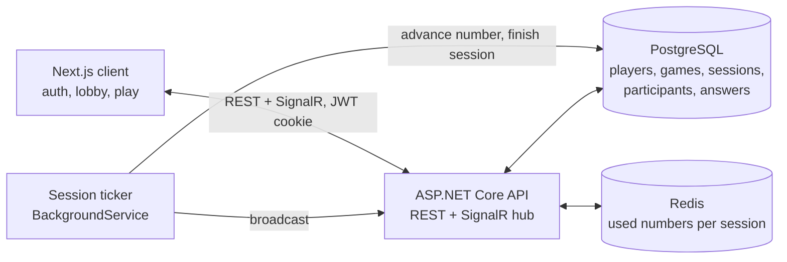
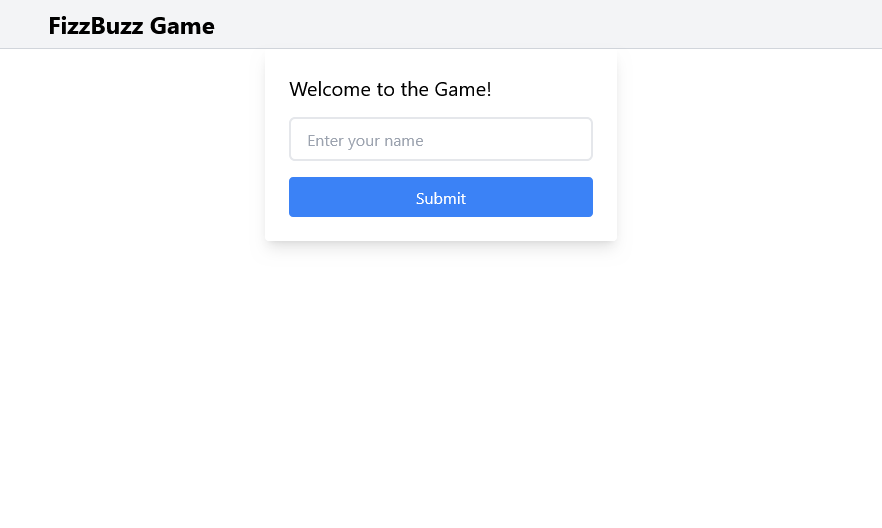
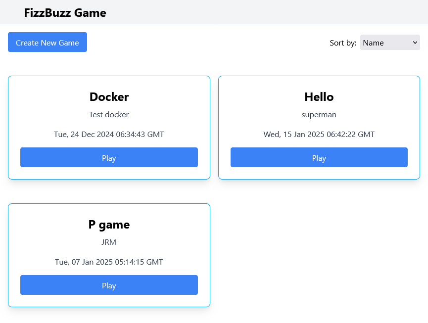
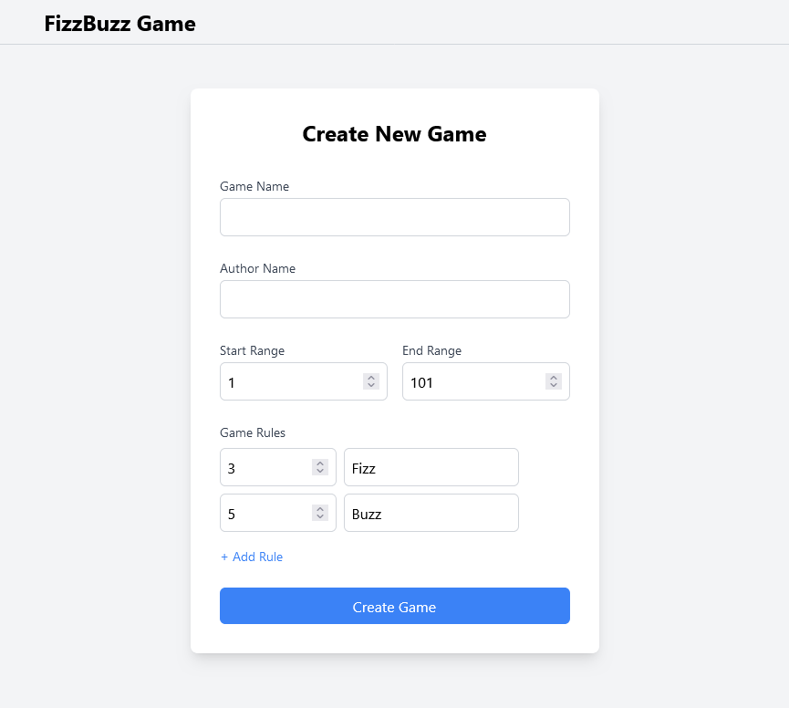
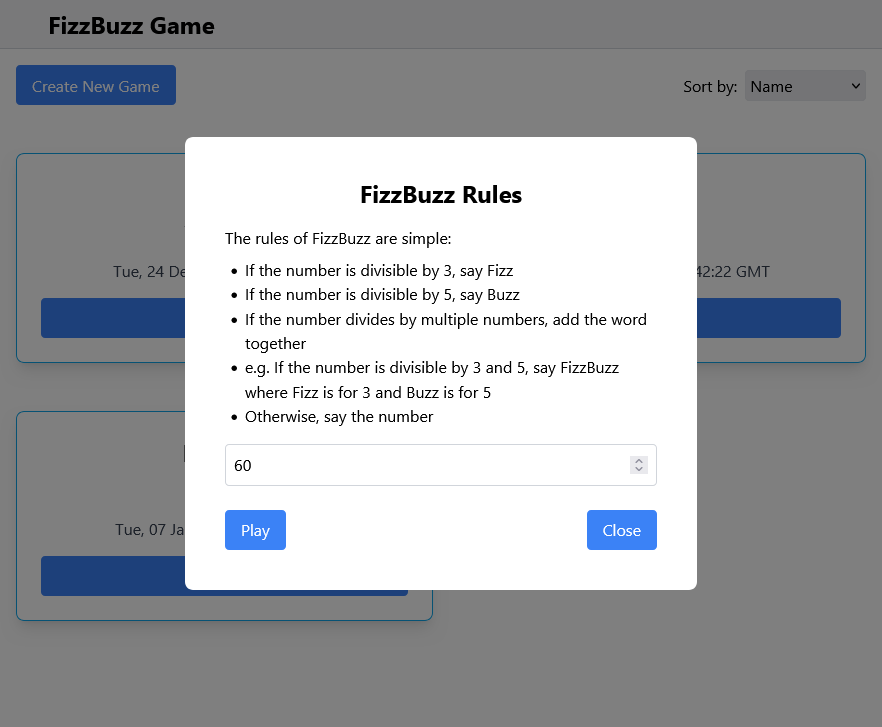
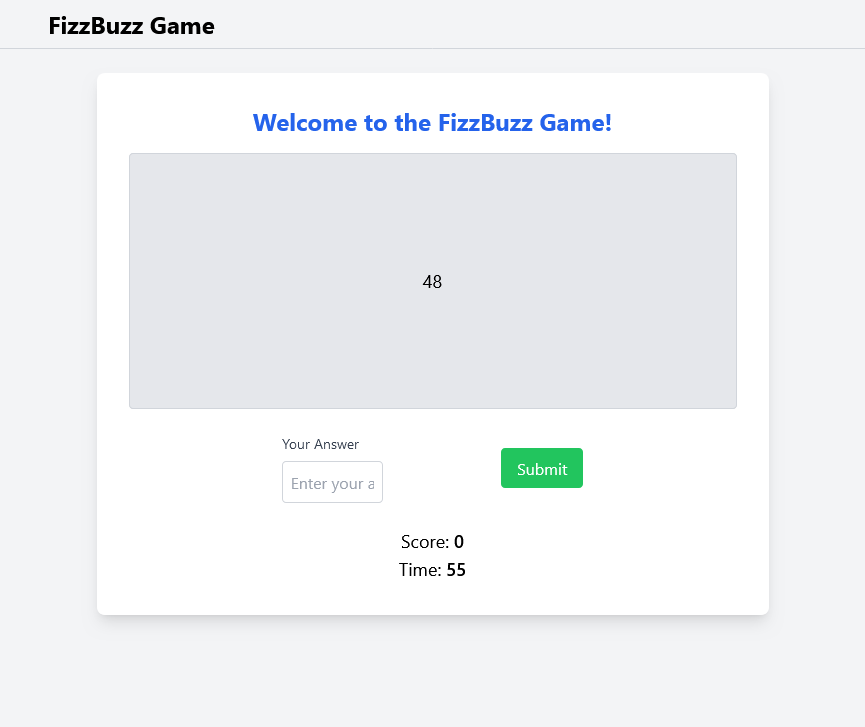
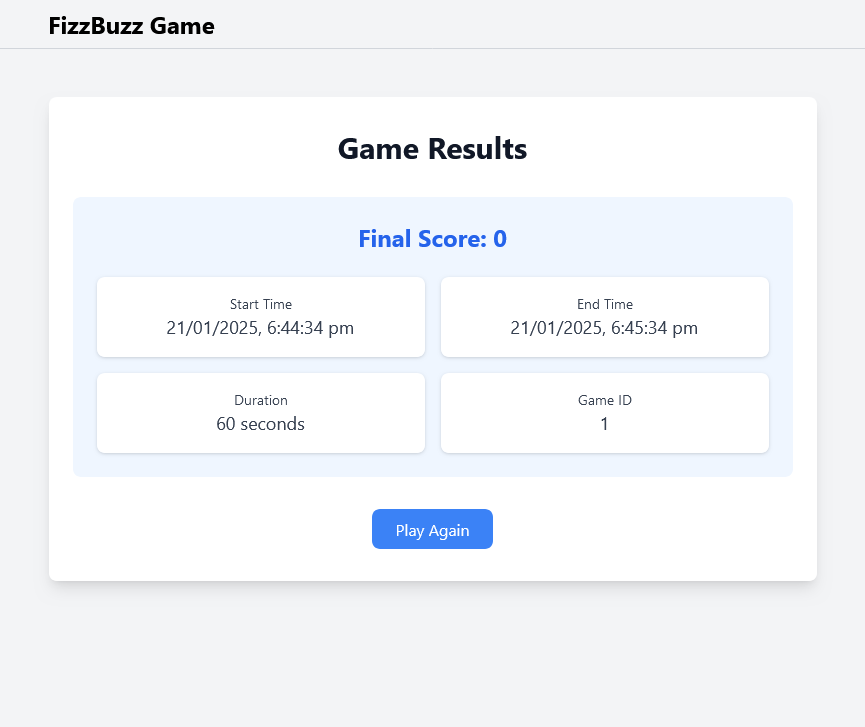

# FizzBuzz Game

A multiplayer web app for playing FizzBuzz with custom rules. Players register, join shared live sessions, answer the same numbers on a server clock, and see live scores.

This is a portfolio prototype. It runs on local Docker Compose with synthetic data. A coding agent wrote most of this refactor under my direction, and I reviewed and verified the result. See Limitations below for what it does not do.

## Architecture


```mermaid
flowchart LR
  Browser["Next.js client<br/>auth, lobby, play"]
  API["ASP.NET Core API<br/>REST + SignalR hub"]
  Tick["Session ticker<br/>BackgroundService"]
  PG[("PostgreSQL<br/>players, games, sessions,<br/>participants, answers")]
  RD[("Redis<br/>used numbers per session")]

  Browser <-->|"REST + SignalR, JWT cookie"| API
  Tick -->|"advance number, finish session"| PG
  Tick -->|"broadcast"| API
  API <--> PG
  API <--> RD
```

The server owns the rules. Score, ranges, current number, clock, and expiry all live server side. The client sends answers and renders what the server broadcasts. Postgres is authoritative for sessions, participants, scores, and answered rounds. Redis keeps only used numbers per session.

Decisions are recorded in docs/DECISIONS.md. The exact API and hub wire shapes are in docs/CONTRACTS.md.

## Prerequisites

- .NET 8 SDK
- Node.js 22
- Docker

## How to run

1. Copy the env template and fill in secrets:
```bash
cp .env.example .env
```
Set POSTGRES_PASSWORD and Jwt__SigningKey (minimum 32 chars). The backend refuses to boot without them.
2. Start the stack:
```bash
docker compose up --build
```
3. Open http://localhost:3000, register, create or join a session, play.

Local dev without Docker: run Postgres and Redis yourself, set the same env vars, then `dotnet run --project backend` and `npm run dev` in frontend/.

## How to test

Backend (82 tests: 61 unit, 21 integration against real Postgres and Redis via Testcontainers, needs Docker):
```bash
dotnet test backend/backend.sln --configuration Release
```

Frontend (32 Vitest component tests):
```bash
cd frontend && npm run test:run
```

Guardrails run in the pre-commit hook and CI: dotnet format, ESLint, Prettier, tsc, plus both suites. The hook lives in hooks/ and is active via `git config core.hooksPath hooks`.

## Screenshots

These predate the refactor and show the old solo UI. The layout changed, the game is the same.

Login Page

Game List

Create Game

Rules Pop Up

Gameplay

Result


## Tech stack

- Frontend: Next.js 15 with TypeScript, Tailwind CSS, Vitest
- Backend: ASP.NET Core 8, SignalR, xUnit, Testcontainers
- Data: PostgreSQL 17, Redis 7
- Infra: Docker Compose, GitHub Actions CI

## Limitations

- Single backend replica. The session ticker runs in-process, so two replicas would double-advance numbers. Documented in D25.
- Access JWT only, no refresh tokens. Sessions last 8 hours, then re-login.
- No E2E tests. Component and integration coverage only, no Playwright flows.
- No production deployment path. Local Compose only, no TLS termination, no secret manager, no migration strategy beyond dev reset.
- Session scores only. No cross-session totals or global leaderboard.
- No password reset, no email verification, no account deletion.
- Screenshots are stale, see note above.
