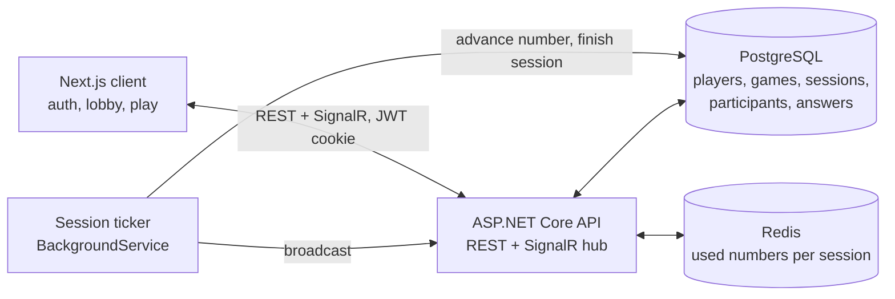

# FizzBuzz Game

[](https://github.com/ctru0009/FizzBuzz/actions/workflows/ci.yml)
[](https://dotnet.microsoft.com/)
[](https://nextjs.org/)
[](https://www.postgresql.org/)
[](LICENSE)

A multiplayer web app for playing FizzBuzz with custom rules. Players register, join shared live sessions, answer the same numbers on a server clock, and see live scores.

This is a portfolio prototype. It runs on local Docker Compose with synthetic data. A coding agent wrote most of this refactor under my direction, and I reviewed and verified the result.

## Contents

- [Architecture](#architecture)
- [Quickstart](#quickstart)
- [Configuration](#configuration)
- [Testing](#testing)
- [API overview](#api-overview)
- [Project structure](#project-structure)
- [Docs](#docs)
- [Tech stack](#tech-stack)
- [Limitations](#limitations)
- [License](#license)

## Architecture


```mermaid
flowchart LR
  Browser["Next.js client<br/>auth, lobby, play"]
  API["ASP.NET Core API<br/>REST + SignalR hub"]
  Tick["Session ticker<br/>BackgroundService"]
  PG[("PostgreSQL<br/>players, games, sessions,<br/>participants, answers")]
  RD[("Redis<br/>used numbers per session")]

  Browser <-->|"REST + SignalR, JWT cookie"| API
  Tick -->|"advance number, finish session"| PG
  Tick -->|"broadcast"| API
  API <--> PG
  API <--> RD
```

The server owns the rules. Score, ranges, current number, clock, and expiry all live server side. The client sends answers and renders what the server broadcasts. Postgres is authoritative for sessions, participants, scores, and answered rounds. Redis keeps only used numbers per session.

Full detail: docs/architecture.md. Wire shapes: docs/CONTRACTS.md. Design calls: docs/DECISIONS.md.

## Quickstart

Prerequisites: .NET 8 SDK, Node.js 22, Docker.

```bash
git clone https://github.com/ctru0009/FizzBuzz.git
cd FizzBuzz
cp .env.example .env
```

Edit `.env` and set `POSTGRES_PASSWORD` plus `Jwt__SigningKey` (minimum 32 chars). The backend refuses to boot without them.

```bash
docker compose up --build
```

Open http://localhost:3000, register, create or join a session, play.

Local dev without Docker: run Postgres and Redis yourself, set the same env vars, then `dotnet run --project backend` and `npm run dev` in frontend/. See docs/development.md.

## Configuration

All config comes from environment. See .env.example for every key.

| Key | Required | Default | Notes |
|---|---|---|---|
| POSTGRES_PASSWORD | yes | none | Compose refuses to start without it |
| Jwt__SigningKey | yes | none | Minimum 32 chars, env only, never committed |
| POSTGRES_DB, POSTGRES_USER | no | fizzbuzz, postgres | |
| Jwt__Issuer, Jwt__Audience | no | fizzbuzz | |
| Jwt__LifetimeHours | no | 8 | Re-login after expiry, no refresh tokens |
| Game__NumberIntervalSeconds | no | 15 | Valid 5 to 120 |
| Cors__AllowedOrigins__0 | no | http://localhost:3000 | |
| NEXT_PUBLIC_BASE_URL | no | http://localhost:8080 | Baked at frontend build time |
| ASPNETCORE_ENVIRONMENT | no | Development | |

## Testing

Backend, 82 tests (61 unit, 21 integration on real Postgres and Redis via Testcontainers, needs Docker):

```bash
dotnet test backend/backend.sln --configuration Release
```

Frontend, 32 Vitest component tests:

```bash
cd frontend && npm run test:run
```

Guardrails run in the pre-commit hook and CI: dotnet format, ESLint, Prettier, tsc, plus both suites. The hook lives in hooks/ and is active via `git config core.hooksPath hooks`. Details: docs/testing.md.

## API overview

Auth is a JWT in an HttpOnly cookie plus antiforgery tokens on mutations. Full shapes in docs/api.md and docs/CONTRACTS.md.

| Method | Route | Auth | Purpose |
|---|---|---|---|
| POST | /api/players/register | no | Register, sets cookie |
| POST | /api/players/login | no | Login, sets cookie |
| POST | /api/players/logout | cookie | Clears cookie |
| GET | /api/players/me | cookie | Current player |
| GET | /api/antiforgery/token | no | CSRF token for mutations |
| GET | /api/games | no | List games |
| POST | /api/games | cookie + XSRF | Create game |
| POST | /api/sessions | cookie + XSRF | Create session |
| GET | /api/sessions/open | no | Open lobby sessions |
| GET | /api/sessions/{id} | cookie | Session snapshot |
| GET | /health/live, /health/ready | no | Health checks |

SignalR hub at /sessionHub: JoinSession, SubmitAnswer, LeaveSession. Server broadcasts NumberAdvanced, ScoresUpdated, SessionEnded.

## Project structure

```text
backend/        ASP.NET Core API, SignalR hub, ticker, EF migrations
frontend/       Next.js client, Vitest tests
tests/          xUnit unit plus Testcontainers integration tests
docs/           Contracts, decisions, architecture, guides
hooks/          Pre-commit guardrail checks
.github/        CI pipeline
```

## Docs

- docs/architecture.md, how the pieces fit and where state lives
- docs/development.md, local setup, env vars, common commands
- docs/testing.md, suites, how to run, red-green rule
- docs/api.md, REST and hub reference with examples
- docs/CONTRACTS.md, binding wire shapes
- docs/DECISIONS.md, design decision log
- CONTRIBUTING.md, SECURITY.md

## Tech stack

- Frontend: Next.js 15 with TypeScript, Tailwind CSS, Vitest
- Backend: ASP.NET Core 8, SignalR, xUnit, Testcontainers
- Data: PostgreSQL 17, Redis 7
- Infra: Docker Compose, GitHub Actions CI

## Limitations

- Single backend replica. The session ticker runs in-process, so two replicas would double-advance numbers.
- Access JWT only, no refresh tokens. Sessions last 8 hours, then re-login.
- No E2E tests. Component and integration coverage only, no Playwright flows.
- No production deployment path. Local Compose only, no TLS termination, no secret manager, no migration strategy beyond dev reset.
- Session scores only. No cross-session totals or global leaderboard.
- No password reset, no email verification, no account deletion.

## License

MIT, see LICENSE.
