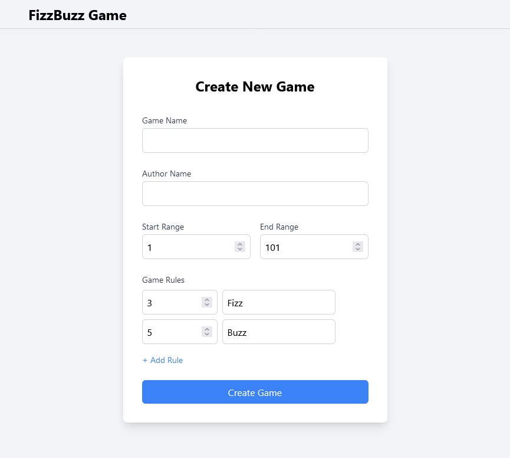

# FizzBuzz Game

A modern web application for playing the classic FizzBuzz game with customizable rules and multiplayer support.

## Features

- 🎮 Create custom FizzBuzz games with configurable rules
- 👥 Real-time game session updates
- 📊 Track game sessions and view results
- 🏆 Score tracking and game result after play
- 🔒 Simple authentication and session management
- 📱 Responsive design for all devices

## Tech Stack

- Frontend: Next.js with TypeScript
- Backend: ASP.NET Core
- Real-time Communication: SignalR
- Database: Posgresql
- Styling: Tailwind CSS

## Screenshot

Login Page

Game List 

Create Game

Rules Pop Up

Gameplay

Result


## Getting Started

### Prerequisites

- Node.js (v18 or later)
- .NET 8.0 SDK
- Postgresql
- Docker

### Running the Application

1. Clone the repository:
```bash
git clone https://github.com/ctru0009/FizzBuzz
cd FizzBuzz
```
2. Run app with docker
```bash
docker-compose up --build
```
3. Open URL and enjoy!
```
localhost:3000
```