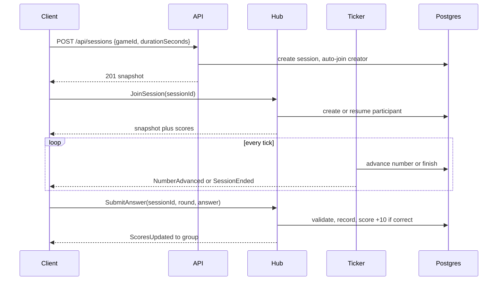

# Architecture

## Pieces

- Next.js client: auth forms, games list with open lobby, session create, live play page, results. No game rules, no clock, no score math. It renders what the server says.
- ASP.NET Core API: REST controllers for players, games, sessions, plus the SignalR hub for live play.
- Session ticker: a BackgroundService that wakes every NumberIntervalSeconds (default 15). Each tick, per open session: past EndTime means mark Finished and broadcast SessionEnded, else pick the next unused number, bump the round, persist, broadcast NumberAdvanced.
- PostgreSQL: players, games, rules, sessions, participants, answers. Authoritative for everything except used numbers.
- Redis: used numbers per session at `session:{id}:used`, JSON int list, TTL is session remaining plus 5 minutes grace.

## Request flow

## Auth

Name plus password, PasswordHasher, JWT in an HttpOnly cookie named `fizzbuzz_auth` (8h). JwtBearer reads the cookie for API and hub. Mutations need an antiforgery token from `GET /api/antiforgery/token` in the `X-XSRF-TOKEN` header. Register, login, logout are exempt. Rate limits: 5/min per IP on register and login, 60/min per IP on the hub endpoint.

## Key invariants

- The server never trusts client score, ranges, numbers, or clock.
- One answer row per (SessionId, PlayerId, Round), enforced by a unique constraint. The hub prechecks, the DB is the backstop.
- Submit validation order: session exists, Open, caller joined, round equals current, no existing answer.
- Reconnect resumes by player id, never by connection id.
- Single replica only. The ticker is in-process, two replicas would double-advance.
